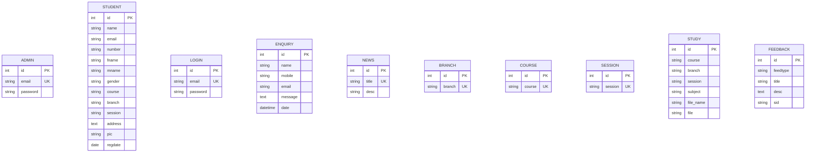

# 🧬 Biotech Park, Lucknow - Web Application & Portal


A comprehensive, state-of-the-art Web Application and Online Learning Portal (OLP) for **Biotech Park, Lucknow** — India's premier biotechnology research center and scientific incubator, developed during the **Softpro Internship**.

---

## 🌟 Key Features

### 🏛️ 1. Public Website & Institutional Portal
* **Dynamic Hero & News Ticker**: Features a high-impact responsive hero banner and a live database-driven news ticker announcement marquee.
* **Institutional Showcase**: Detailed sections for **About Us**, **Organization Vision & Mission**, **Services & Facilities**, **Accreditations & Certifications** (DSIR, NABL, ISO 9001:2008, ISO 14001:2015, UPSDM).
* **Leadership & Mentors**: Showcases distinguished scientific advisors, UP Leadership, and institutional mentors.
* **Public Enquiry System**: Visitors can submit inquiries directly via an interactive contact form, stored securely in the database for admin review.
* **Interactive Training Program Display**: Highlights student training tracks in Bioinformatics, Industrial Biotech, Microbiology, and Plant Tissue Culture.

### 🛡️ 2. Admin Control Panel (`/adlogin/`)
* **Session Authentication**: Secure session-based access control protecting all administrative routes.
* **Interactive Metric Dashboard**: Overview widgets displaying live counts of study materials, registered students, news, public enquiries, complaints, and suggestions.
* **Student Management**: View complete registered student profiles including contact numbers, parents' names, courses, branches, sessions, and profile picture previews.
* **News & Announcement Manager**: Full CRUD (Create, Read, Update, Delete) capability to publish news items live to the public website.
* **Academic Master Data Management**: Add, edit, and delete **Courses**, **Branches**, and **Academic Sessions**.
* **Study Material Uploader**: Upload educational PDFs, PPTs, or document files filtered by specific Course, Branch, and Session.
* **Enquiry Management**: Review and manage inquiries submitted by public visitors.

### 🎓 3. Student Portal (`/login/` & `/registration/`)
* **Online Registration**: Easy-to-use registration form with dynamic dropdowns for Courses, Branches, and Sessions, supporting avatar uploads.
* **Automated Welcome Email**: Generates an HTML welcome email dispatched upon successful registration.
* **Student Dashboard**: Personalized profile dashboard displaying student details (Father's Name, Mother's Name, Registration Date, Address) and quick statistics.
* **Course-Filtered Study Materials**: Students can access and download study materials uploaded specifically for their enrolled course, branch, and session.
* **Feedback & Complaint Portal**: Submit category-tagged Feedbacks, Suggestions, or Complaints, track submission history, and manage submitted entries.

---

## 🛠️ Technology Stack

| Layer | Technologies Used |
|---|---|
| **Backend Framework** | Python, Django 5.x |
| **Database** | SQLite3 |
| **Frontend Framework** | HTML5, CSS3, Bootstrap 5.3, JavaScript (ES6) |
| **Icons & Typography** | Font Awesome 6, Plus Jakarta Sans |
| **Templating Engine** | Django Template Language (DTL) |
| **Session & Auth** | Django Session Middleware & Custom Decorators |

---

## 📂 Project Architecture

```text
biotech/
├── biotech/                 # Core Project Configuration
│   ├── settings.py          # Django settings, Installed Apps, Media & Email configs
│   ├── urls.py              # Root URL Routing
│   ├── wsgi.py              # WSGI Entry Point
│   └── asgi.py              # ASGI Entry Point
│
├── mainapp/                 # Public Website & Registration Module
│   ├── models.py            # Admin, Student, Login, and Enquiry Models
│   ├── views.py             # Public views, Student Auth, Registration & Enquiry
│   ├── mainurls.py          # Main URLs configuration
│   ├── static/              # CSS Stylesheets, Images, and Fonts
│   └── templates/           # Public HTML Templates (index, about, org, certi, etc.)
│
├── adminapp/                # Admin Management Dashboard Module
│   ├── models.py            # News, Branch, Course, Session, and Study Models
│   ├── views.py             # Admin Dashboard, Student List, CRUD Operations
│   ├── adminurls.py         # Admin URL Routing
│   └── templates/           # Admin Dashboard HTML Templates
│
├── studentapp/              # Student Portal Module
│   ├── models.py            # Feedback & Complaint Model
│   ├── views.py             # Student Dashboard, Filtered Study Materials, Feedbacks
│   ├── stuurls.py           # Student Portal URL Routing
│   └── templates/           # Student Portal HTML Templates
│
├── media/                   # Media Storage (Uploaded Student Pics & Study Files)
├── db.sqlite3               # SQLite Database File
├── manage.py                # Django CLI Command Utility
└── README.md                # Project Documentation
```

---

## 🚀 Installation & Setup Guide

### 1. Prerequisites
Ensure you have the following installed on your machine:
* Python 3.10+
* `pip` (Python Package Installer)
* Git

### 2. Clone / Navigate to Directory
```bash
cd c:\Users\HP\OneDrive\Desktop\biotech
```

### 3. Create & Activate Virtual Environment (Optional but Recommended)
```bash
# Windows
python -m venv venv
venv\Scripts\activate

# macOS / Linux
python3 -m venv venv
source venv/bin/activate
```

### 4. Install Dependencies
```bash
pip install django
```

### 5. Apply Database Migrations
```bash
python manage.py makemigrations
python manage.py migrate
```

### 6. Run System Check
Verify that the project has zero errors:
```bash
python manage.py check
```

### 7. Start the Development Server
```bash
python manage.py runserver
```

Open your web browser and navigate to:  
👉 **`http://127.0.0.1:8000/`**

---

## 🗺️ Application Sitemap & URL Routing

### Public Routes (`mainapp`)
* `/` — Home Page
* `/about/` — About Biotech Park
* `/organization/` — Governance, Vision & Mission
* `/services/` — Facilities & Research Labs
* `/certification/` — Accreditations & Quality Standards
* `/enquiry/` — Public Enquiry & Contact Form
* `/registration/` — Student Course Registration
* `/login/` — Student Portal Login
* `/adlogin/` — Admin Control Panel Login
* `/logout/` — Logout & Clear Session

### Admin Portal Routes (`adminapp`)
* `/adparent/adhome/` — Admin Metric Dashboard
* `/adparent/adstudent/` — Registered Students List
* `/adparent/adnews/` — Manage News Announcements
* `/adparent/adbranch/` — Branch Master Data
* `/adparent/adcourse/` — Course Master Data
* `/adparent/adsession/` — Session Master Data
* `/adparent/adstudy/` — Upload Study Material
* `/adparent/viewstudy/` — View Uploaded Study Materials
* `/adparent/viewenquiries/` — View Public Enquiries

### Student Portal Routes (`studentapp`)
* `/student/` — Student Personal Dashboard
* `/student/stunews/` — View News Announcements
* `/student/stustudy/` — Filtered Study Material Download Center
* `/student/stufeedback/` — Submit Feedback / Complaint
* `/student/viewfeedback/` — View My Submitted Feedbacks

---

## 📊 Database Schema Summary



---

## 🏆 Credits & Acknowledgments

Designed and developed during the **Softpro Internship** for **Biotech Park, Lucknow** (Sector G, Jankipuram, Kursi Road, Lucknow - 226021, UP, INDIA).
